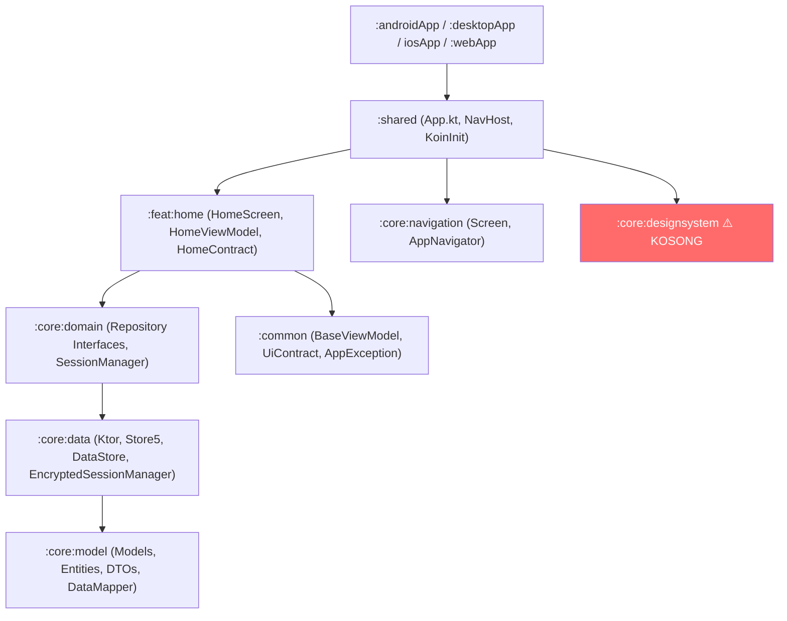

# KMP Starter — Rencana Perbaikan & Peningkatan

> Dokumen ini merangkum hasil audit menyeluruh pada proyek *Compose Multiplatform Starter* dan menjadi panduan bagi kontributor untuk menyelesaikan semua area yang belum selesai, memperbaiki bug tersembunyi, serta meningkatkan kualitas kode sesuai standar *production-grade*.

---

## Ringkasan Arsitektur Saat Ini



---

## Prioritas Tinggi — Bug & Masalah Fungsional Kritis

Bagian ini berisi masalah yang menyebabkan runtime crash atau fungsionalitas yang secara diam-diam tidak bekerja.

---

### 1. 🔴 Desktop App Crash saat Startup

**File:** [`desktopApp/build.gradle.kts`](file:///C:/Users/QTI/Code/KMPStarter/desktopApp/build.gradle.kts)

`mainClass` menunjuk ke `com.project.starter.MainKt` padahal kelas sesungguhnya ada di package `com.project.starter.desktop`.

#### [MODIFY] `desktopApp/build.gradle.kts`
```diff
- mainClass = "com.project.starter.MainKt"
+ mainClass = "com.project.starter.desktop.MainKt"
```

---

### 2. 🔴 Desktop Tidak Memiliki Ktor Engine

**File:** [`core/data/build.gradle.kts`](file:///C:/Users/QTI/Code/KMPStarter/core/data/build.gradle.kts)

`jvmMain` tidak memiliki Ktor engine, sehingga network call di Desktop akan crash dengan `Unresolved HttpClientEngine`.

#### [MODIFY] `core/data/build.gradle.kts`
```kotlin
jvmMain.dependencies {
    implementation(libs.ktor.client.okhttp) // atau ktor-client-cio
}
```

Dan tambahkan di `libs.versions.toml`:
```toml
ktor-client-cio = { module = "io.ktor:ktor-client-cio", version.ref = "ktor" }
```

---

### 3. 🔴 GlobalErrorMapper Tidak Pernah Dipasang

**File:** [`core/data/src/commonMain/.../HttpClientFactory.kt`](file:///C:/Users/QTI/Code/KMPStarter/core/data/src/commonMain/kotlin/com/project/starter/core/data/network/HttpClientFactory.kt)

`installGlobalErrorMapper()` ada tapi tidak pernah dipanggil di dalam `createHttpClient()`.

#### [MODIFY] `HttpClientFactory.kt`
```diff
  fun createHttpClient(): HttpClient {
      return HttpClient {
          install(ContentNegotiation) { json(Json { ignoreUnknownKeys = true }) }
+         installGlobalErrorMapper()
      }
  }
```

---

### 4. 🔴 iOS KoinInit Crash Jika Dipanggil Dua Kali

**File:** [`shared/src/iosMain/.../MainViewController.kt`](file:///C:/Users/QTI/Code/KMPStarter/shared/src/iosMain/kotlin/com/project/starter/shared/MainViewController.kt)

`initKoin()` dipanggil setiap kali `MainViewController()` diinstansiasi, menyebabkan `KoinAppAlreadyStartedException`.

#### [MODIFY] `MainViewController.kt`
```diff
  fun MainViewController() = ComposeUIViewController {
-     initKoin()
      App()
  }

+ // Di iOS AppDelegate atau modul terpisah:
+ fun initApp() {
+     if (getKoinApplicationOrNull() == null) initKoin()
+ }
```

---

### 5. 🔴 AppNavigator Tidak Terhubung ke NavHostController

**File:** [`shared/src/commonMain/.../App.kt`](file:///C:/Users/QTI/Code/KMPStarter/shared/src/commonMain/kotlin/com/project/starter/shared/App.kt)

`AppNavigator` tidak didaftarkan ke Koin, tidak diobservasi di `App.kt`, dan tidak digunakan oleh ViewModel manapun.

#### [MODIFY] `DataModule.kt` / tambah ke Koin
```kotlin
single { AppNavigator() }
```

#### [MODIFY] `App.kt`
```kotlin
val navigator: AppNavigator = koinInject()
LaunchedEffect(Unit) {
    navigator.navigationEvents.collect { event ->
        when (event) {
            is NavigationEvent.NavigateTo -> navController.navigate(event.route)
            is NavigationEvent.NavigateBack -> navController.popBackStack()
        }
    }
}
```

---

## Prioritas Tinggi — Kelemahan Arsitektur

---

### 6. 🟠 `HomeViewModel` Tidak Menggunakan Domain Layer

**File:** [`feat/home/src/commonMain/.../HomeViewModel.kt`](file:///C:/Users/QTI/Code/KMPStarter/feat/home/src/commonMain/kotlin/com/project/starter/feat/home/presentation/HomeViewModel.kt)

ViewModel menggunakan data hardcoded, tidak melalui repository atau use case.

#### [MODIFY] `HomeViewModel.kt`
```kotlin
class HomeViewModel(
    private val getExampleUseCase: GetExampleUseCase // inject via Koin
) : BaseViewModel<HomeEvent, HomeState, HomeEffect>() {

    private fun loadItems() {
        launch {
            setState { copy(isLoading = true) }
            getExampleUseCase()
                .onSuccess { items -> setState { copy(items = items, isLoading = false) } }
                .onFailure { e -> setEffect(HomeEffect.ShowToast(e.message ?: "Error")) }
        }
    }
}
```

---

### 7. 🟠 `ExampleApiService` Adalah Stub Kosong

**File:** [`core/data/src/commonMain/.../ExampleApiService.kt`](file:///C:/Users/QTI/Code/KMPStarter/core/data/src/commonMain/kotlin/com/project/starter/core/data/network/ExampleApiService.kt)

Semua kode Ktor di-comment-out dan fungsi mengembalikan `emptyList()`.

#### [MODIFY] `ExampleApiService.kt`
```kotlin
class ExampleApiService(private val client: HttpClient) {
    suspend fun fetchExamples(): List<ExampleResponse> = client.get("/examples").body()
}
```

---

### 8. 🟠 `ExampleRepositoryImpl`: Store5 Tanpa SourceOfTruth

**File:** [`core/data/src/commonMain/.../ExampleRepositoryImpl.kt`](file:///C:/Users/QTI/Code/KMPStarter/core/data/src/commonMain/kotlin/com/project/starter/core/data/repository/ExampleRepositoryImpl.kt)

Store5 hanya memiliki `Fetcher` tanpa `SourceOfTruth` persistern, dan `Fetcher` mengembalikan data hardcoded.

#### [MODIFY] `ExampleRepositoryImpl.kt`
```kotlin
// Perlu SourceOfTruth — gunakan DataStore atau SQLDelight
private val store = StoreBuilder
    .from(
        fetcher = Fetcher.of { key: String -> apiService.fetchExamples() },
        sourceOfTruth = SourceOfTruth.of(
            reader = { dataStore.data.map { it[KEY_EXAMPLES] } },
            writer = { _, items -> dataStore.edit { it[KEY_EXAMPLES] = items.serialize() } }
        )
    ).build()
```

---

### 9. 🟠 `EncryptedSessionManager` Tidak Dienkripsi

**File:** [`core/data/src/commonMain/.../EncryptedSessionManager.kt`](file:///C:/Users/QTI/Code/KMPStarter/core/data/src/commonMain/kotlin/com/project/starter/core/data/local/EncryptedSessionManager.kt)

Nama "Encrypted" menyesatkan — token disimpan sebagai plaintext di DataStore biasa.

**Solusi yang Direkomendasikan:**
- **Android**: Gunakan `androidx.security:security-crypto` dengan `EncryptedSharedPreferences` atau `BiometricPrompt`
- **iOS**: Gunakan Keychain via `expect/actual`
- **Desktop**: Gunakan `java.security.KeyStore` + `javax.crypto`

Implementasikan dengan pattern `expect/actual`:
```kotlin
// commonMain
expect class SecureStorage {
    suspend fun saveToken(key: String, value: String)
    suspend fun getToken(key: String): String?
}
```

---

### 10. 🟠 Tidak Ada Use Case di `core:domain`

`core:domain` hanya berisi interface repository. Tidak ada `UseCase` / `Interactor`.

#### [NEW] `core/domain/src/commonMain/.../usecase/GetExamplesUseCase.kt`
```kotlin
class GetExamplesUseCase(private val repository: ExampleRepository) {
    suspend operator fun invoke(): Result<List<ExampleModel>> = 
        runCatching { repository.getExamples() }
}
```

---

### 11. 🟠 `HomeEffect` Tidak Pernah Dikonsumsi di `HomeScreen`

**File:** [`feat/home/src/commonMain/.../HomeScreen.kt`](file:///C:/Users/QTI/Code/KMPStarter/feat/home/src/commonMain/kotlin/com/project/starter/feat/home/presentation/HomeScreen.kt)

`viewModel.effect` tidak di-collect, sehingga `ShowToast` tidak pernah tampil ke pengguna.

#### [MODIFY] `HomeScreen.kt`
```kotlin
LaunchedEffect(Unit) {
    viewModel.effect.collect { effect ->
        when (effect) {
            is HomeEffect.ShowToast -> snackbarHostState.showSnackbar(effect.message)
        }
    }
}
```

---

## Prioritas Sedang — Kualitas Kode (Code Quality)

---

### 12. 🟡 Race Condition di `BaseViewModel.setState()`

**File:** [`common/src/commonMain/.../BaseViewModel.kt`](file:///C:/Users/QTI/Code/KMPStarter/common/src/commonMain/kotlin/com/project/starter/common/base/BaseViewModel.kt)

#### [MODIFY] `BaseViewModel.kt`
```diff
- val newState = currentState.reduce()
- _uiState.value = newState
+ _uiState.update { currentState -> currentState.reduce() }
```

---

### 13. 🟡 `Channel.RENDEZVOUS` untuk Effects Bisa Menyebabkan Deadlock

Effects menggunakan `Channel<Effect>()` default (RENDEZVOUS, kapasitas 0). Jika tidak ada collector aktif (misalnya saat app di background), `send()` akan suspend selamanya.

#### [MODIFY] `BaseViewModel.kt`
```diff
- private val _uiEffect = Channel<Effect>()
+ private val _uiEffect = Channel<Effect>(Channel.BUFFERED)
```

---

### 14. 🟡 `koinInject()` vs `koinViewModel()` untuk ViewModel

**File:** [`shared/src/commonMain/.../App.kt`](file:///C:/Users/QTI/Code/KMPStarter/shared/src/commonMain/kotlin/com/project/starter/shared/App.kt)

`koinInject<HomeViewModel>()` tidak terikat ke `ViewModelStoreOwner`, menyebabkan instance baru dibuat setiap rekomposisi.

#### [MODIFY] `App.kt`
```diff
- val viewModel: HomeViewModel = koinInject()
+ val viewModel: HomeViewModel = koinViewModel()
```

---

### 15. 🟡 `collectAsState()` vs `collectAsStateWithLifecycle()`

**File:** [`feat/home/src/commonMain/.../HomeScreen.kt`](file:///C:/Users/QTI/Code/KMPStarter/feat/home/src/commonMain/kotlin/com/project/starter/feat/home/presentation/HomeScreen.kt)

`collectAsState()` terus aktif saat app di background. Gunakan `collectAsStateWithLifecycle()` dari `androidx.lifecycle:lifecycle-runtime-compose`.

---

### 16. 🟡 `Column` Biasa untuk List di `HomeScreen`

Menggunakan `Column` untuk rendering list tidak scalable untuk data berukuran besar.

#### [MODIFY] `HomeScreen.kt`
```diff
- Column {
-     items.forEach { item -> ExampleItem(item) }
- }
+ LazyColumn {
+     items(items) { item -> ExampleItem(item) }
+ }
```

---

### 17. 🟡 Build Logic — Duplikasi Dependencies & Version Hardcoded

**File:** [`build-logic/convention/build.gradle.kts`](file:///C:/Users/QTI/Code/KMPStarter/build-logic/convention/build.gradle.kts)

- `kotlin.gradlePlugin` di-declare dua kali
- Room Gradle Plugin hardcoded sebagai raw string `"2.7.0-alpha11"` alih-alih referensi catalog

#### [MODIFY] `build-logic/convention/build.gradle.kts`
```diff
  dependencies {
      implementation(libs.kotlin.gradlePlugin)
-     implementation(libs.kotlin.gradlePlugin) // duplikat
      implementation(libs.agp.gradlePlugin)
-     implementation("androidx.room:room-gradle-plugin:2.7.0-alpha11")
  }
```

---

### 18. 🟡 Convention Plugin Tidak Mengenkapsulasi Android SDK Config

Setiap modul menduplikasi blok `android { compileSdk = 37; minSdk = 24 }` secara manual. Ini seharusnya dikontrol dari satu tempat di convention plugin.

#### [MODIFY] `build-logic/convention/src/main/kotlin/configs/ConfigKmp.kt` atau convention plugin terkait
```kotlin
// Di dalam fun Project.configureAndroidKmpLibrary()
android {
    compileSdk = ConventionConstants.COMPILE_SDK_VERSION // 37
    defaultConfig.minSdk = ConventionConstants.MIN_SDK_VERSION // 24
}
```

#### [MODIFY] `ConventionConstants.kt`
```diff
- const val MIN_SDK_VERSION = 24
- const val MAX_SDK_VERSION = 34  // ⚠️ outdated, harus 37
+ const val MIN_SDK_VERSION = 24
+ const val COMPILE_SDK_VERSION = 37
+ const val TARGET_SDK_VERSION = 37
```

---

## Prioritas Sedang — Fitur yang Perlu Ditambahkan

---

### 19. 🟡 `core:designsystem` — Tema & Komponen UI (KOSONG)

Modul ini **kosong total**. Sebagai starter project yang baik, perlu berisi:

#### [NEW] File-file yang perlu dibuat:
- `Theme.kt` — `MaterialTheme` wrapper dengan `lightColorScheme`, `darkColorScheme`
- `Color.kt` — Color palette utama
- `Typography.kt` — Custom `TextStyle` untuk Heading, Body, Label
- `Shape.kt` — Rounded corner definitions
- `components/Button.kt` — Reusable primary/secondary button
- `components/TextField.kt` — Reusable text input dengan error state
- `components/LoadingIndicator.kt` — Circular/linear progress
- `components/ErrorView.kt` — Generic error state composable

```kotlin
// Theme.kt
@Composable
fun StarterTheme(
    darkTheme: Boolean = isSystemInDarkTheme(),
    content: @Composable () -> Unit
) {
    val colorScheme = if (darkTheme) darkColorScheme(...) else lightColorScheme(...)
    MaterialTheme(colorScheme = colorScheme, typography = StarterTypography, content = content)
}
```

---

### 20. 🟡 `core:testing` — Test Infrastructure (KOSONG)

Modul testing **kosong total**. Sebagai starter, perlu menyediakan:

#### [NEW] File-file yang perlu dibuat:
- `FakeExampleRepository.kt` — In-memory fake untuk unit testing
- `FakeSessionManager.kt` — Fake untuk session testing
- `TestDispatcherRule.kt` — `TestRule` untuk ganti `Dispatchers.Main` di JVM test
- `BaseViewModelTest.kt` — Helper class setup turbine + StateFlow assertion

```kotlin
// FakeExampleRepository.kt
class FakeExampleRepository : ExampleRepository {
    var fakeData: List<ExampleModel> = emptyList()
    var shouldThrow: Boolean = false

    override suspend fun getExamples(): List<ExampleModel> {
        if (shouldThrow) throw AppException.NetworkException("Fake network error")
        return fakeData
    }
}
```

---

### 21. 🟡 Unit Tests — Coverage 0%

CI menjalankan test task, tetapi tidak ada test sama sekali. Perlu ditambahkan setidaknya test dasar.

#### [NEW] Test files yang perlu dibuat:
- `feat/home/src/commonTest/.../HomeViewModelTest.kt`
- `core/data/src/commonTest/.../ExampleRepositoryImplTest.kt`  
- `core/domain/src/commonTest/.../GetExamplesUseCaseTest.kt`
- `common/src/commonTest/.../BaseViewModelTest.kt`

**Dependency yang perlu ditambahkan:**
```toml
[versions]
turbine = "1.2.0"
kotlinx-coroutines-test = "1.11.0"

[libraries]
turbine = { module = "app.cash.turbine:turbine", version.ref = "turbine" }
kotlinx-coroutines-test = { module = "org.jetbrains.kotlinx:kotlinx-coroutines-test", version.ref = "kotlinx-coroutines" }
```

---

### 22. 🟡 Navigasi — Hanya Satu Route

**File:** [`core/navigation/src/commonMain/.../Screen.kt`](file:///C:/Users/QTI/Code/KMPStarter/core/navigation/src/commonMain/kotlin/com/project/starter/core/navigation/Screen.kt)

Sebagai starter, navigasi harus mendemonstrasikan minimal dua screen dengan argument passing.

#### [MODIFY] `Screen.kt`
```kotlin
sealed class Screen {
    @Serializable
    data object Home : Screen()

    @Serializable
    data class Detail(val id: String) : Screen()
}
```

#### [NEW] `feat/detail/` — Feature module detail sebagai contoh navigasi antar screen

---

### 23. 🟡 Web/WasmJS Target Masih Di-comment-out

**File:** [`build-logic/convention/src/main/kotlin/configs/ConfigKmp.kt`](file:///C:/Users/QTI/Code/KMPStarter/build-logic/convention/src/main/kotlin/configs/ConfigKmp.kt)

Target WasmJS dan `webApp` module di-comment-out. Dengan Store5 menggantikan Room (yang tidak kompatibel dengan WasmJS), target ini bisa diaktifkan kembali.

#### [MODIFY] `ConfigKmp.kt`
```diff
- // wasmJs { browser() }
+ wasmJs { browser() }
```

#### [MODIFY] `settings.gradle.kts`
```diff
- // include(":webApp")
+ include(":webApp")
```

Perlu tambahkan Ktor engine untuk wasmJS:
```toml
ktor-client-js = { module = "io.ktor:ktor-client-js", version.ref = "ktor" }
```

---

## Prioritas Rendah — Penyempurnaan & Best Practices

---

### 24. 🔵 `DataMapper` Tidak Pernah Digunakan

**File:** [`core/model/src/commonMain/.../DataMapper.kt`](file:///C:/Users/QTI/Code/KMPStarter/core/model/src/commonMain/kotlin/com/project/starter/core/model/DataMapper.kt)

`DataMapper` dengan extension functions sudah ada tapi tidak pernah dipakai karena `ExampleApiService` dan `ExampleRepositoryImpl` tidak terhubung.

**Aksi:** Setelah poin 7 dan 8 diselesaikan, integrasikan `DataMapper` di `ExampleRepositoryImpl`:
```kotlin
fetcher = Fetcher.of { apiService.fetchExamples().map { it.toModel() } }
```

---

### 25. 🔵 Rename Script Perlu Dokumentasi

**File:** [`rename.py`](file:///C:/Users/QTI/Code/KMPStarter/rename.py)

Script `rename.py` sangat berguna untuk user yang ingin menggunakan starter ini, tapi tidak ada dokumentasi cara menggunakannya di README.

#### [MODIFY] `README.md`
Tambahkan bagian **"Getting Started"**:
```markdown
## Getting Started

1. Clone repositori ini
2. Jalankan script rename untuk menyesuaikan nama package:
   ```bash
   python rename.py com.your.package YourAppName
   ```
3. Buka di Android Studio atau IntelliJ IDEA
```

---

### 26. 🔵 Tambahkan Dependabot untuk Auto-Update Dependencies

#### [NEW] `.github/dependabot.yml`
```yaml
version: 2
updates:
  - package-ecosystem: "gradle"
    directory: "/"
    schedule:
      interval: "weekly"
    open-pull-requests-limit: 5
```

---

### 27. 🔵 Tambahkan Pull Request Template

#### [NEW] `.github/PULL_REQUEST_TEMPLATE.md`
Template standar dengan checklist: tipe perubahan, deskripsi, cara test, screenshot (jika UI).

---

### 28. 🔵 CI — Tambahkan Build Cache & Artifact Upload

**File:** [`.github/workflows/ci.yml`](file:///C:/Users/QTI/Code/KMPStarter/.github/workflows/ci.yml)

#### [MODIFY] `ci.yml`
```yaml
- name: Upload APK
  if: github.ref == 'refs/heads/main'
  uses: actions/upload-artifact@v4
  with:
    name: debug-apk
    path: androidApp/build/outputs/apk/debug/*.apk
    retention-days: 7
```

---

## Rangkuman Prioritas Kerja

| # | Item | Prioritas | Effort |
|---|------|-----------|--------|
| 1 | Desktop App mainClass crash | 🔴 Kritis | XS |
| 2 | Desktop Ktor engine missing | 🔴 Kritis | XS |
| 3 | GlobalErrorMapper tidak dipasang | 🔴 Kritis | XS |
| 4 | iOS Koin crash on repeat init | 🔴 Kritis | S |
| 5 | AppNavigator tidak terhubung | 🔴 Kritis | M |
| 6 | HomeViewModel tidak pakai Domain | 🟠 Tinggi | M |
| 7 | ExampleApiService stub kosong | 🟠 Tinggi | M |
| 8 | Store5 tanpa SourceOfTruth | 🟠 Tinggi | L |
| 9 | EncryptedSessionManager tidak encrypt | 🟠 Tinggi | L |
| 10 | Tidak ada Use Cases di domain | 🟠 Tinggi | M |
| 11 | HomeEffect tidak dikonsumsi | 🟠 Tinggi | XS |
| 12 | Race condition di BaseViewModel | 🟡 Sedang | XS |
| 13 | Channel RENDEZVOUS untuk effects | 🟡 Sedang | XS |
| 14 | koinInject vs koinViewModel | 🟡 Sedang | XS |
| 15 | collectAsStateWithLifecycle | 🟡 Sedang | XS |
| 16 | LazyColumn untuk list | 🟡 Sedang | XS |
| 17 | Build logic duplications | 🟡 Sedang | S |
| 18 | Convention plugin SDK config | 🟡 Sedang | S |
| 19 | core:designsystem kosong | 🟡 Sedang | L |
| 20 | core:testing kosong | 🟡 Sedang | L |
| 21 | Unit tests 0% coverage | 🟡 Sedang | XL |
| 22 | Navigasi hanya 1 route | 🟡 Sedang | M |
| 23 | WasmJS target disabled | 🟡 Sedang | M |
| 24 | DataMapper tidak digunakan | 🔵 Rendah | XS |
| 25 | Rename script undocumented | 🔵 Rendah | XS |
| 26 | Dependabot setup | 🔵 Rendah | XS |
| 27 | PR Template | 🔵 Rendah | XS |
| 28 | CI artifact upload | 🔵 Rendah | XS |

> **Legend effort:** XS < 30 menit · S = 1-2 jam · M = 2-4 jam · L = 4-8 jam · XL = 1+ hari

---

## Rencana Eksekusi Bertahap

### Fase 1 — Bug Fixes (Kritis) 🔴
Poin 1–5: Selesaikan semua bug yang menyebabkan crash atau silent failure. Hasil: semua platform berjalan tanpa error runtime.

### Fase 2 — Arsitektur (Tinggi) 🟠
Poin 6–11: Hubungkan semua lapisan arsitektur (Domain → Data → Presentation) agar benar-benar berfungsi end-to-end.

### Fase 3 — Code Quality 🟡
Poin 12–18: Perbaiki masalah kualitas kode yang lebih halus. Tidak mengubah fungsionalitas, tapi mencegah masalah di masa depan.

### Fase 4 — Kelengkapan Starter 🟡
Poin 19–23: Tambahkan konten ke modul yang masih kosong (designsystem, testing, tests) dan aktifkan fitur yang belum lengkap (WasmJS, navigasi detail).

### Fase 5 — Polish 🔵
Poin 24–28: Penyempurnaan dokumentasi dan tooling.
